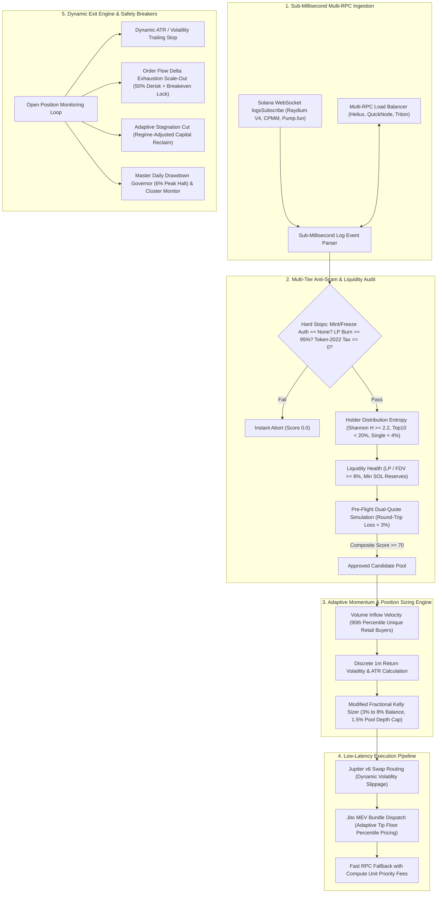

# bot-solona

# Quantitative Solana Adaptive High-Frequency Trading Bot

[](https://www.python.org/)
[](https://solana.com/)
[](https://jup.ag/)
[](https://jito.wtf/)
[](https://render.com)
[](LICENSE)

An institutional-grade, fully asynchronous Solana algorithmic trading system and live mobile-optimized dashboard engineered in Python (`solders`, `solana-py`, `aiohttp`, `websockets`).

The architecture strictly rejects rigid, hardcoded trade rules. Instead, entry sizes, trailing stops, scale-outs, and capital allocations dynamically adapt in real time based on **on-chain order-book liquidity depth**, **discrete return volatility (ATR / $\sigma_{1m}$)**, **retail inflow velocity**, and **holder distribution entropy**.

---

## 🚀 Hosting on Render (render.com)

This repository is pre-configured for **instant hosting on Render**:

### Method 1: Web Service (Recommended)
1. Go to [Render Dashboard](https://dashboard.render.com/) and click **New + > Web Service**.
2. Connect your GitHub repository `n3k4a1223/bot-solona`.
3. Render will automatically detect `render.yaml` or you can set:
   - **Runtime**: `Python 3`
   - **Build Command**: `pip install -r requirements.txt`
   - **Start Command**: `python server.py`
   - **Health Check Path**: `/health`
4. Click **Deploy**. Your live mobile-friendly dashboard will be available at `https://your-app.onrender.com`!

### Method 2: Static Site (100% Free & Fast)
1. In Render, select **New + > Static Site**.
2. Connect `n3k4a1223/bot-solona`.
3. Set:
   - **Build Command**: `echo "Build ready"`
   - **Publish Directory**: `.`
4. Click **Create Static Site**. Render will serve `index.html` across its global CDN.

---

## 1. Architectural Blueprint & Data Pipeline



---

## 2. Core Quantitative & Mathematical Foundations

### A. Dynamic Position Sizing (Modified Kelly Criterion with Volatility Scaling)
Rather than trading fixed token or SOL increments, capital allocation is governed by a modified fractional Kelly formulation coupled with volatility normalization and order-book depth constraints:

$$f^* = \left( \frac{p \cdot b - q}{b} \right) \times f_{\text{Kelly}}$$

Where:
- $p$: Win probability adaptively estimated from composite anti-scam score $S \in [70, 100]$ and buyer inflow velocity percentile $M \in [90, 100]$:
  $$p = 0.52 + 0.20 \times \left( \frac{S - 70}{30} \right) \times \left( \frac{M - 50}{50} \right)$$
- $b$: Estimated payoff ratio based on asymmetric momentum setups ($b = 2.2$).
- $q = 1 - p$: Loss probability.
- $f_{\text{Kelly}} = 0.35$: Fractional Kelly factor to eliminate gambler's ruin risk.

#### Volatility Normalization Factor:
Risk exposure is normalized across volatile market conditions by scaling inversely with the standard deviation of 1-minute discrete returns:

$$\text{VolScale} = \text{clamp}\left(\frac{\sigma_{\text{target}}}{\max(\sigma_{1m}, 0.01)}, 0.4, 1.6\right)$$

#### Strict Dynamic Boundaries & Liquidity Depth Cap:
To eliminate slippage impact and market dislocation, position sizes are bounded strictly between 3% and 8% of liquid balance and capped at 1.5% of total pool SOL reserves:

$$\text{Allocated SOL} = \min\left( B_{\text{wallet}} \times \text{clamp}(f^* \cdot \text{VolScale}, 0.03, 0.08), \; R_{\text{SOL}} \times 0.015 \right)$$

---

### B. Holder Distribution Entropy & Gini Inequality
To identify synthetic cabal clustering and insider supply dominance before a dump occurs, the bot evaluates the Shannon Entropy ($H$) across non-pool token holders:

$$H = -\sum_{i=1}^{N} p_i \ln(p_i)$$

Where $p_i$ is holder $i$'s normalized fraction of sampled supply.
- **Requirement**: $H \ge 2.20$, aggregate Top 10 non-pool holdings $< 20.0\%$, and maximum single private wallet $< 4.0\%$.

---

### C. Dynamic Liquidity Health (LP-to-Market-Cap Ratio)
Prevents capital allocation into deceptive pools designed to inflate fully diluted valuations (FDV) with disproportionately thin liquidity backing:

$$\text{Ratio} = \frac{\text{Total LP Value (SOL)}}{\text{Fully Diluted Valuation (SOL)}} = \frac{2 \cdot R_{\text{SOL}}}{\text{Total Supply} \cdot \left( \frac{R_{\text{SOL}}}{R_{\text{token}}} \right)} = \frac{2 \cdot R_{\text{token}}}{\text{Total Supply}}$$

- **Rule**: If $\text{Ratio} < 8.0\%$, the pool is instantly aborted as an illiquid rug/trap.

---

### D. Volatility-Based Trailing Stop (Continuous ATR Ratchet)
Static percentage stops fail during volatile momentum runs. The stop-loss band continuously updates dynamically based on the token's real-time standard deviation of 1-minute returns ($\sigma_{1m}$) and discrete Average True Range (ATR):

$$D_{\text{stop}} = k_{\text{atr}} \times \max\left( \text{ATR}_{\text{SOL}}, \; P_{\text{peak}} \times \sigma_{1m} \right)$$

$$\text{Stop Price}_t = \max\left( \text{Stop Price}_{t-1}, \; P_{\text{peak}} - D_{\text{stop}} \right)$$

The stop-loss band ratchets monotonically upwards as prices advance, protecting accrued profits while accommodating organic volatility swings.

---

### E. Buyer Volume Delta Exhaustion Scale-Out
Rather than targeting arbitrary price multiples, profits are realized dynamically when order flow demonstrates buyer exhaustion:
- When Sell Volume $\Delta_{\text{sell}} > \Delta_{\text{buy}}$ across 2 consecutive evaluation intervals:
  1. **Scale-Out 1**: Liquidate 50% of the position and ratchet the trailing stop of the remaining tokens to entry price (breakeven protection).
  2. **Scale-Out 2**: Liquidate remaining 50% upon secondary exhaustion or trailing stop breach.

---

### F. Adaptive Stagnation Capital Reclaim
Holding timeout adapts inversely to market volatility regimes:
- **EXTREME Volatility**: 60-second inactivity timeout.
- **HIGH Volatility**: 90-second timeout.
- **NORMAL Volatility**: 120-second timeout.
- **LOW Volatility**: 180-second timeout.
If trade volume collapses below $2\times$ median baseline and price momentum is flat, the position is immediately liquidated to free capital for high-velocity opportunities.

---

### G. Master Daily Drawdown Governor & Cluster Congestion Guard
1. **Cluster Congestion**: Continuously tracks Solana TPS, mean slot time, and transaction failure rates via `getRecentPerformanceSamples`. If failure rate exceeds 25%, sizing is defensively halved.
2. **Daily Drawdown Governor**: Tracks portfolio high-water mark peak equity:
   $$\text{Drawdown} = \frac{\text{Peak Equity} - \text{Current Equity}}{\text{Peak Equity}} \ge 6.0\%$$
   Tripping this breaker immediately halts all new trade entries.

---

## 3. Codebase Structure

```
c:\Users\maham\Downloads\bot\
├── config/
│   ├── __init__.py
│   └── settings.py          # Pydantic Settings, environment configs, RPC endpoints
├── core/
│   ├── __init__.py
│   ├── types.py             # Typed dataclasses (RiskScore, Position, TradeSignal, etc.)
│   ├── logger.py            # Rich async terminal logger & live status panels
│   ├── rpc_balancer.py      # Multi-RPC load balancer, latency tracking & failover
│   └── ws_listener.py       # WebSocket logsSubscribe client (Raydium, Pump.fun)
├── filters/
│   ├── __init__.py
│   ├── security_filter.py   # Mint/Freeze authority, LP burn, Token-2022 tax audit
│   ├── holder_analyzer.py   # Holder entropy, Top 10 concentration, Gini coefficient
│   ├── liquidity_health.py  # LP-to-MC ratio, initial liquidity depth vs FDV
│   ├── honeypot_sim.py      # Pre-flight dual-quote buy/sell simulation & tax check
│   └── composite_filter.py  # Orchestrator synthesizing composite risk scores
├── analytics/
│   ├── __init__.py
│   ├── momentum_tracker.py  # Buyer inflow velocity, 90th percentile, anti-spoofing
│   ├── volatility_engine.py # Real-time ATR, 1m return stdev, volatility regimes
│   └── position_sizer.py    # Modified Kelly Criterion, depth cap, dynamic allocation
├── execution/
│   ├── __init__.py
│   ├── jupiter_client.py    # Jupiter v6 Swap API route quoting & swap building
│   ├── jito_client.py       # Jito Block Engine MEV bundle client & adaptive tip floor
│   └── executor.py          # Keypair signer (solders), Jito bundles & RPC fallback
├── risk/
│   ├── __init__.py
│   ├── circuit_breaker.py   # Cluster congestion monitor & daily drawdown governor
│   └── exit_engine.py       # Volatility trailing stop, exhaustion scale-out, stagnation cut
├── tests/
│   └── test_quantitative_engine.py # Full unit test suite (pytest)
├── engine.py                # Master quantitative trading orchestrator pipeline
├── main.py                  # CLI driver, signal handling, and simulation mode
├── requirements.txt         # Pinned production dependencies
├── .env.example             # Documented environment variables template
└── README.md                # System documentation & mathematical specification
```

---

## 4. Quick Start & Execution

### Prerequisites
- Python 3.10+ (tested on Python 3.10, 3.11, 3.12, 3.13, 3.14)
- Solana RPC credentials (Helius, QuickNode, Triton, or public endpoints)

### 1. Install Dependencies
```bash
pip install -r requirements.txt
```

### 2. Configure Environment
Copy `.env.example` to `.env` and configure your wallet private key and RPC endpoints:
```bash
cp .env.example .env
```

### 3. Run Mathematical Simulation Cycle
Run an end-to-end simulation cycle demonstrating pool discovery, security filtering, retail momentum detection, Kelly sizing, Jito tip calculation, scale-outs, and ATR trailing stops:
```bash
python main.py --simulate-cycle
```

### 4. Run Automated Test Suite
Execute the comprehensive test suite validating all mathematical logic:
```bash
python -m pytest tests/test_quantitative_engine.py -v
```

### 5. Launch Paper-Trading / Dry-Run Mode
```bash
python main.py
```

### 6. Launch Live Mainnet Trading (Capital at Risk)
```bash
python main.py --live
```
